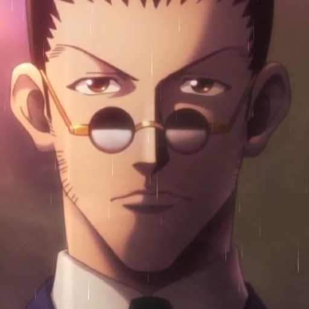
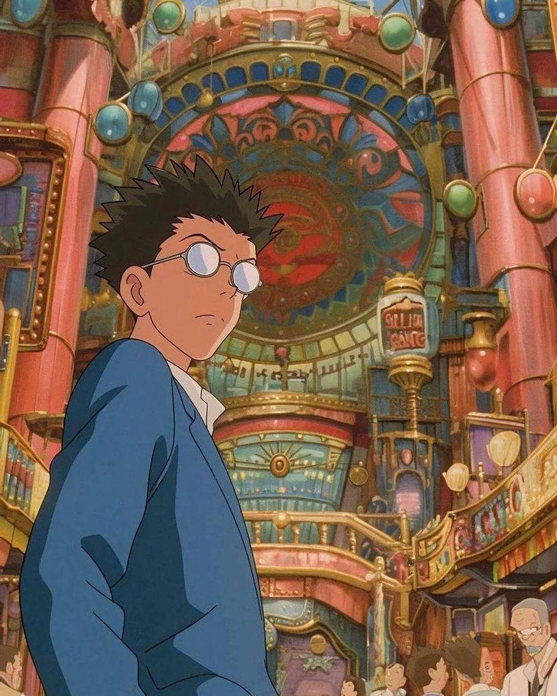
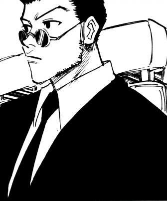

# Leorio BOT

Um bot para tocar músicas no servidor no meu amigo. Me basei no código de [pawel02](https://github.com/pawel02/discord-js-music-bot).

**Leorio Nunca Abandona seus amigos.**

  
  

